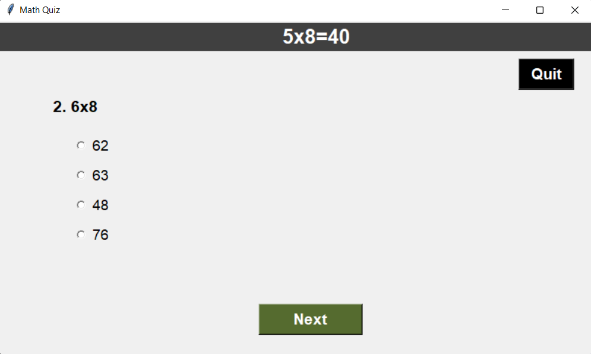

# quiz-game-with-python
Creating a math game using python and tkinter for my daughter. Now you can choose the distribution of math facts including addition / subtraction (+/-) and multiplication / division (x/÷).

Questions update on each game.

